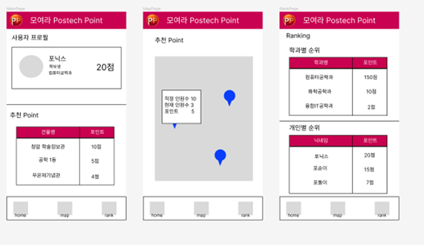

## 에너지 절약 애플리케이션 기반 건물별 인원 최적 분배

# 모여라! P.P
 

**「스마트캠퍼스 에너지 데이터 활용 아이디어 챌린지」 출품작**

-----

    

    

>본 README 는 기획서의 내용을 일부 발췌했습니다.

# 1. 아이디어 개요
-------
>  이상고온과 한파가 찾아오는 2023년 대한민국의 여름철에는 기존보다 더 큰 더위가 몰려오고, 겨울철에는 더 큰 추위가 몰려오며 사계절의 경계가 흐릿해지고 있습니다. 열대 기후로 변해가는 여름철과 한파로 인해 폭설이 쏟아지는 겨울철의 교내 에너지 사용량은 과거보다 매우 큰 폭으로 증가하고 있습니다. 
  

&nbsp;그렇다면 냉난방을 위해 사용되는 에너지는 건물의 이용자들에게 효과적으로 사용되고 있을까요? 이용자가 몰리게 되는 여름의 청암학술정보관은 실내 적정온도로 냉방을 하더라도 사람들에게서 나오는 열기로 인해 이용자들이 느끼는 체감 온도는 매우 올라갑니다. 또한, 사람들이 몰리는 건물은 사람에게서 나오는 열기와 여러 유동적인 상황으로 인해 적정온도로 유지하는 과정에서 더 큰 에너지를 소모하게 됩니다. 반면, 이용자가 적은 다른 건물에서는 같은 실내 적정온도로 냉방을 하더라도 훨씬 더 시원하게 느껴집니다. 하지만 이용자 수가 거의 없는 건물임에도 적정온도의 유지를 위해 냉난방이 이뤄지고 있으므로 소모되는 에너지 또한 크게 낭비되고 있습니다. 특정한 건물에만 사람이 몰리게 되고, 이로 인해 많은 양의 에너지들은 낭비되고 있었습니다.
  
&nbsp;교내 인구 밀집으로 인한 에너지 낭비 문제를 효과적으로 해결하기 위해 고안한 아이디어가 바로 ‘모여라 P.P' 애플리케이션입니다. 모여라 P.P는 학습과 운동 등 이용자들의 목적에 따라 최적의 건물을 추천해주고 이용자들이 건물별 실시간 이용자 수를 파악할 수 있도록 돕는 애플리케이션입니다. 기존에 수집된 스마트캠퍼스 에너지 데이터와 실시간으로 수집되는 데이터를 토대로 건물의 최적 이용자 수에 맞게 이용자들에게 장소를 추천합니다. 특히 이용자들의 자발적인 참여를 위해서 에너지 사용이 증가하게 되는 기간 중, 이용자가 추천 장소로 이동하여 머무르게 될 경우 포인트를 지급하여 추후 리워드가 지급되는 보상 시스템이 존재합니다. 이용자들은 앱을 통해 실시간으로 최적의 건물을 이용할 수 있게 되고, 학교 전체적으로는 유동 인구를 건물별로 고르게 분배하여 에너지의 효율을 극대화할 수 있게 되는 것이 모여라 P.P의 역할입니다.

# 2. 세부 사항
-----
&nbsp;모여라 P.P(Postech Point)는 포항공대의 교내 구성원을 대상으로 한 애플리케이션이며 주요 기능은 건물별 현재 이용자 수, 적정 이용자 수 등을 제공하여 이용자들에게 쾌적한 Point를 추천하는 애플리케이션입니다. 이용자들은 이용 목적을 공부와 운동으로 나눠 공부를 하고자 한다면 해당하는 장소 중 학습 관련 추천 장소를 제공하고, 반대로 운동을 하고자 하는 경우 운동 가능 장소를 추천하게 됩니다. 또한, 단순히 이용자 수를 토대로 최적 장소를 추천해주는 것 외에도 이벤트 기간이 있어 특정 기간동안 추천하는 건물을 이용할 경우 포인트를 지급하여 이벤트 기간이 종료된 이후 순위에 따라 소정의 상품을 지급하고 이용자들의 참여를 유도하게 됩니다.

&nbsp;애플리케이션의 이벤트 기간은 전력 사용량이 많아지며 에너지의 사용이 큰 폭으로 증가하게 되는 여름철과 겨울철 위주로 선정했습니다. 이와 더불어 일별 교내 기온 데이터와 에너지 사용정보 공고를 토대로 교내에서 온도가 큰 폭으로 낮아지거나 높아져 많은 에너지가 사용된 기간을 선정했습니다.

&nbsp;현재까지 선정된 이벤트 기간은 1, 6, 7, 8, 12월입니다. 이벤트 기간은 일별 교내 기온 데이터와 에너지 사용정보 공고를 토대로 전력과 수도의 사용이 높은 기간 위주로 선정했습니다. 예시로 [그림2] 처럼 2020년과 2021년 포스텍의 전력 사용량을 통해 확인할 수 있듯이 6, 7, 8월이 많은 에너지가 사용되는 기간이며 특히 여름(6~8월)과 겨울(12월 ~ 1월)에 이용되는 에너지가 큰 폭으로 증가합니다. 이처럼 월 평균 이용량보다 에너지 사용량이 큰 기간과 교내 기온 데이터를 기반으로 기온에 큰 변화가 있어 에너지 사용량이 클 것으로 예상되는 기간을 종합해서 이벤트 기간을 선정하였습니다.

&nbsp;이벤트 기간 중에는 매일 이용자들에게 추천 장소가 알람 형대로 제공됩니다. 추천 장소는 1일 2~3회 제공되며 사람들이 특정 건물로 집중되는 시간대에 추천 건물과 건물 이용시 지급되는 포인트가 공개됩니다. 이용자들은 알람이 전달된 후 30분 이내에 건물로 이동해야 하며, 건물에서 1시간 이상 위치가 이동하지 않고 해당 장소에 머무르게 될 경우 명시된 포인트가 지급됩니다.

&nbsp;건물별 포인트는 교내에서 수집된 주요 시설의 실시간 에너지 데이터를 바탕으로 계산된 여러 지표를 통해 선정됩니다. 주요하게 사용되는 데이터는 건물별 네트워크 접속 데이터와 특정 시간대 건물 인원에 대한 추정치 데이터입니다. 건물별 네트워크 접속 데이터를 기반으로 건물의 인원을 파악하게 되고, 이렇게 파악된 데이터와 건물 인원에 대한 추정치 데이터를 종합하여 건물의 실시간 인원을 추정하게 됩니다. 또한, 교내 기온 데이터와 건물 내 온도 데이터를 기반으로 에너지 수요와 건물 내 에너지 효율을 도출합니다.

# 3. 추천 알고리즘
---
&nbsp;건물의 추천 알고리즘은 데이터를 기반으로 새롭게 고안하였습니다. 건물별로 이용 가능 시설이 상이하기 때문에 우선 이용자의 목적에 따라서 건물을 크게 운동 가능 시설과 학습 가능 시설로 구분했습니다. 이후 건물의 인원을 최적으로 분배하는 것과 건물당 수용 가능 인원, 건물의 에너지 효율이 각각 상이하므로 위에서 분류된 건물 중에서 데이터를 기반으로 다음과 같은 지표들을 도입하여 결과값들을 계산하고 추천 건물과 해당 포인트를 선정하게 됩니다.

- **전력의 이용비율**
    
    - 건물별 적정 전력의 이용량은 건물 내 전력 시설 설계를 토대로 실제 수용 가능한 전력량을 추정합니다. 건물별 매월 전력 사용량과 건물의 에너지 효율 정보를 활용하여 건물의 적정 전력 이용량을 도출할 수 있으며 이는 고정된 상수입니다. 1인당 사용 전력의 경우 1인이 시간당 이용하게 되는 전력량의 평균 추정치로 고정된 상수입니다. 마지막으로 특정 시간대 건물 인원에 대한 추정치 데이터를 기반으로 건물의 현재 이용자 수를 추산합니다. 각 변수와 상수의 값을 종합해 전력의 이용비율을 실시간으로 계산합니다.

- **건물의 혼잡도**
    
    - 각 건물에서 수용 가능한 인원수를 기반으로 건물별 출입 건수와 건물별 내부 기온 데이터를 활용하여 에너지 효율에 맞는 적정 인원수를 추산하며 이는 고정된 상수입니다. 건물의 현재 이용자 수는 위에서와 마찬가지로 건물 인원 추정치 데이터를 기반으로 실시간 반영하여 두 값을 토대로 건물의 혼잡도를 도출합니다.

- **건물별 인원에 따른 에너지 효율**
    
    - 건물별 인원에 따른 에너지 효율은 가우시안 분포를 따르며 각 상수는 에너지 데이터를 기반으로 건물별 에너지 효율 곡선을 실제 데이터의 분포와 유사한 형태를 띠도록 계산된 값을 사용합니다. 건물 최대 에너지 효율의 경우 건물의 월별 전력 사용량과 건물 내 온도를 기반으로 건물의 에너지 사용량에 따른 온도 조절 비율에 맞춰서 계산된 최대 에너지 효율이며 고정된 상수입니다. 마찬가지로 건물 현재 이용자 수에 따라서 건물의 효율 지표가 결정됩니다.

- **지표별 종합 점수 산정 및 적정 포인트 변환**
    
    - 위의 식을 통해 계산된 전력의 이용비율, 건물의 혼잡도, 에너지 효율 각각을 100을 기준으로 백분위 점수로 변환하게 되고, 각 반영 비율을 1/3로 하여 건물별 종합 점수를 산정하게 됩니다. 현재는 반영 비율을 고르게 1/3로 선정했으나, 실제 이용자들의 피드백을 반영하여 쾌적한 환경 제공 정도와 에너지 효율을 모두 증가시키기 위해 반영 비율을 조절할 계획입니다. 종합 점수는 표준편차에 따라 상대적 점수인 포인트로 변환하여 활용됩니다.

&nbsp;이벤트 기간동안 합산된 포인트를 기반으로 학과별 / 개인별 순위가 기재되며 보상은 상위 이용자와 학과에게 제공됩니다. 또한, 추가 보상도 지급될 수 있습니다. 추가 보상의 경우 이벤트 기간이 종료된 후 기간동안 실제 사용된 에너지량이 집계되어 예년과 대비하 에너지 사용량이 줄어들었다면, 줄어든 에너지에 비례하여 추가 보상이 지급됩니다.

&nbsp;이벤트가 활성화되지 않은 평소에는 사용자들에게 데이터를 기반으로 건물별 최적 인원, 건물의 온도 등 건물 내부 상황과 이용중인 인원수에 대한 정보가 제공됩니다. 또한, 위의 지표들을 토대로 계산된 종합 점수에 따라 추천 장소도 제공됩니다.

# 4. 구현 과정
-----
&nbsp;캠퍼스 내 센서들이 측정한 에너지 데이터들을 실시간으로 socket 통신을 활용하여 분석 서버에 전달합니다. 분석 서버로 전달된 데이터들은 가공되어 에너지 효율, 전력의 이용비율, 건물의 혼잡도 등을 계산하게 됩니다. 이렇게 계산된 데이터들이 RESTful API를 통해서 모여라 P.P 서비스 애플리케이션으로 전달되며, 이용자들에게 PC용 웹 페이지와 모바일 애플리케이션을 통해 정보가 제공됩니다.
  
&nbsp;모여라 P.P는 PC와 모바일에서 모두 이용이 가능하도록 구현할 계획입니다. 프론트엔드의 경우 프레임워크로 React를 사용합니다. React를 통해 모바일에서도 이용이 가능한 반응형 웹사이트 방식으로 서비스를 구현할 것입니다. 디자인을 입히는 CSS 프레임워크로는 Tailwind를 사용할 계획입니다. 백엔드에서는 로직이 간단하여 데이터 간의 무결성을 보장하는 Mongo DB와 Fastify 기반으로 서버를 구현하고 RESTful API 형식으로 서버를 구성할 계획입니다.
  
&nbsp;UI는 밑의 그림과 같이 디자인했습니다. POSTECH Red를 포인트 색상으로 배경색인 흰색과 대비되어 강조되도록 디자인했습니다. 필수적인 기능인 장소 추천 기능과 순위 제공 기능들을 위주로 기본적인 요소 위주로 디자인했으며, 큰 글씨와 단순한 버튼을 통해 이용자 중심 UI를 구상했습니다.

# 5. 기대 효과
---
- **에너지 사용료 절감**
    
    - 기존 여름철 한 달에 평균 6,000,000kWh 사용량을 건물 사용 인원의 효과적 분배를 통해 약 4,500,000kWh까지 최대 절감이 가능합니다. 따라서 1년 중 에너지 요금으로 사용되는 예산이 줄어들게 됩니다. 기존 에너지 요금으로 사용된 예산 중 최대 30%까지 절감할 수 있으며 전기세 인상 폭을 고려하더라도 예년 대비 약 20% 이상의 예산 절감 효과가 있습니다. 절감된 예산 중 일부를 활용하여 보상 프로그램을 운영하고 서비스의 운영 자금으로도 일부를 사용할 수 있습니다.

- **새로운 데이터 및 부가가치 창출**
    
    - 서비스의 이용자가 증가하고 서비스가 활성화된다면 더욱더 많은 에너지 관련 데이터의 수집이 가능해지며 다양한 부가가치 창출을 위한 밑거름이 됩니다. 많은 데이터를 기반으로 추천 알고리즘을 발전시킨다면 추가적인 에너지 절감 효과를 이끌 수 있게 됩니다. 또한, 수집된 데이터를 통해 건물별 선호도와 시간대별 이용자 수를 조사하여 건물별 적정 운영 계획을 수립할 수 있습니다. 이처럼 애플리케이션 이용자들이 생성한 데이터와 새롭게 수집된 데이터들을 기반으로 새로운 분야에 적용한다면 더 많은 에너지 절감과 부가가치 창출이 가능해집니다.

- **다양한 서비스 제공**
    
    - 서비스를 고정적으로 이용하는 이용자 수가 확보된 이후부터는 다양한 서비스를 추가로 제공할 수 있습니다. 구성원을 대상으로 자유롭게 소통할 수 있는 게시판뿐만 아니라 건물별 실시간 상황을 공유하는 게시판 등 다양한 게시판을 가진 커뮤니티 서비스도 제공할 수 있으며, 이외에도 교내 중고거래 플랫폼, 식사를 같이 할 사람을 모집하는 서비스 등 교내 구성원만을 대상으로 한 다양한 서비스들을 제공할 수 있는 기반이 마련됩니다.

&nbsp;모여라 P.P의 데모 페이지를 통해 확인할 수 있듯이 이미 대부분의 웹 페이지는 구현이 완료된 상태이며 스마트캠퍼스의 데이터를 받아 가공하는 서버만 구현된다면 베타 서비스를 곧바로 시행할 수 있는 상황입니다. 앞으로 모바일 버전을 위한 반응형 웹 디자인과 포인트 산정 로직만 코드로 구현한다면 기획한 서비스를 이용자들에게 제공하는 것이 가능합니다.
  
&nbsp;이용자들의 서비스 참여를 유도하는 것도 충분히 가능합니다. 단순히 에너지를 절약하자는 말로는 사람들의 행동을 끌어내기가 어렵습니다. 에너지 절약을 통해 개인에게 눈으로 보이는 혜택이 돌아오기 전까지는 참여를 독려하기가 어렵습니다. 하지만 보상 프로그램이 있는 모여라 P.P는 리워드를 통해 이용자들의 적극적인 참여를 유도할 수 있습니다. 실제 행동주의 이론에 따르면 보상 프로그램은 인간의 보상 심리를 자극하여 동기부여가 되고, 이러한 강력한 동기는 적극적인 참여를 유도할 수 있게 된다고 합니다. 보상 프로그램을 적용한 캐시워크의 경우 걷기, 문제 풀기 등과 같이 단순한 행동의 참여를 캐쉬보상을 통해 유도하여 가입자를 100만을 넘겼다는 선례 또한 존재합니다. 에너지 절약 정도에 비례하여 추가 지급되는 보상을 통해 더 많은 참여를 유도할 수 있을 것입니다.
  
&nbsp;실제 서비스 개발 단계에서는 기획했던 학습과 운동 목적 외에도 다양한 목적에 따라서 추천 서비스를 제공할 계획입니다. 추후 교내에 있는 다양한 편의시설, 복지시설 등에도 이를 적용하여 활용할 수 있도록 서비스를 발전시키며 건물 단위보다 더 세부적인 층, 호실과 관련된 정보까지 이용할 수 있도록 하여 쾌적한 교내 환경과 에너지 절감을 위해 노력할 계획입니다.

## 개발자 연락처

<a href="mailto:thbrian@postech.ac.kr">

